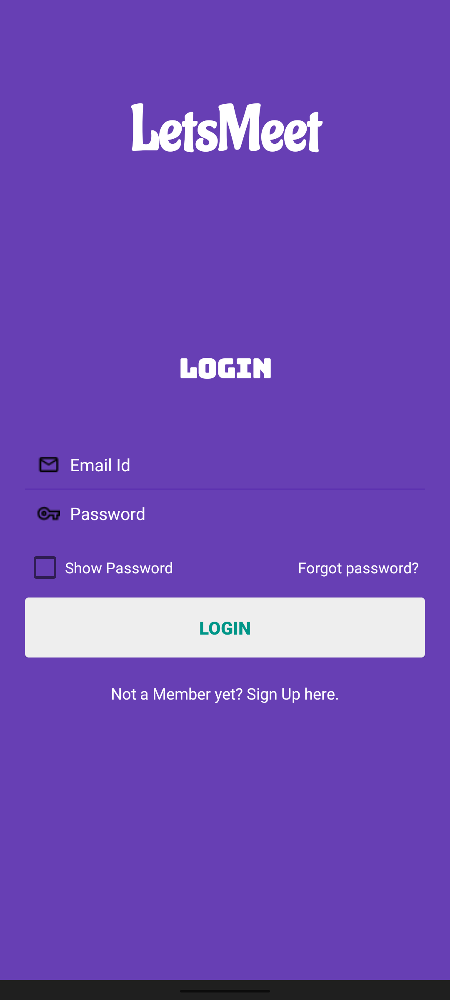
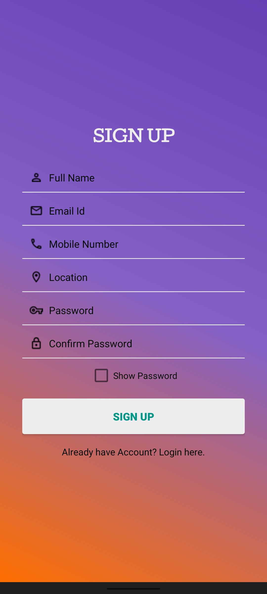
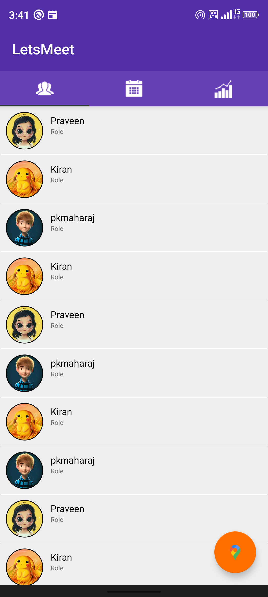
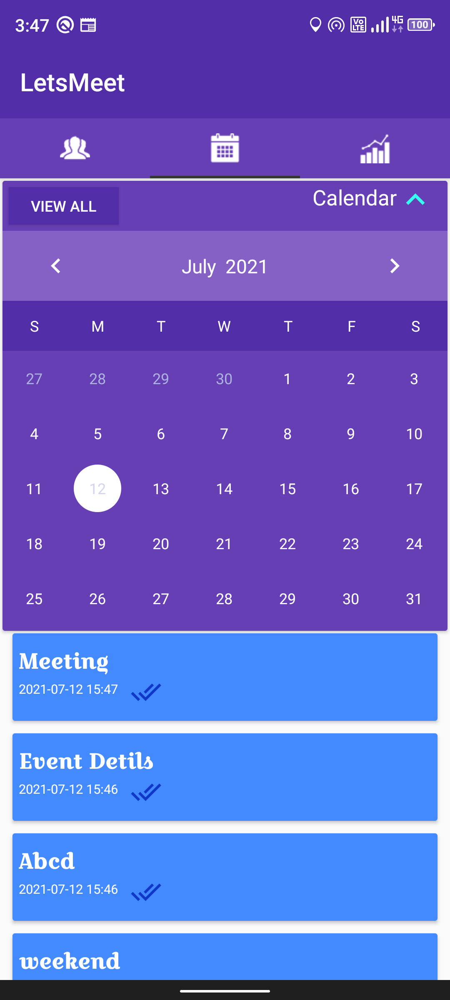
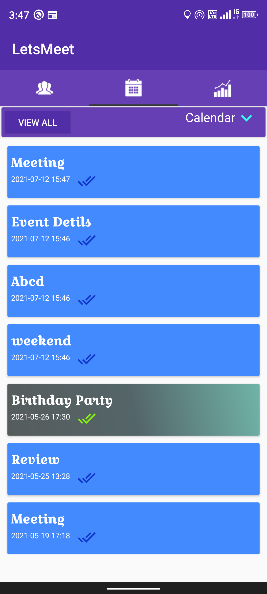
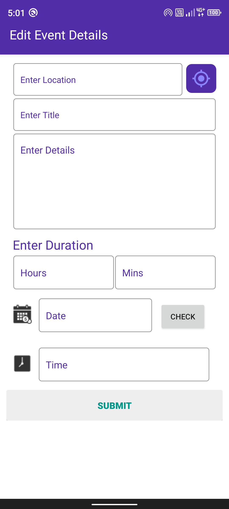
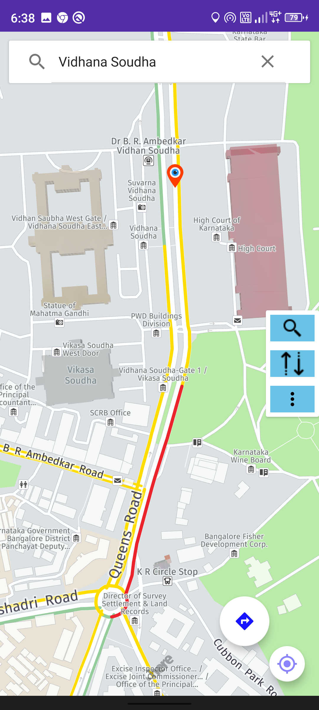
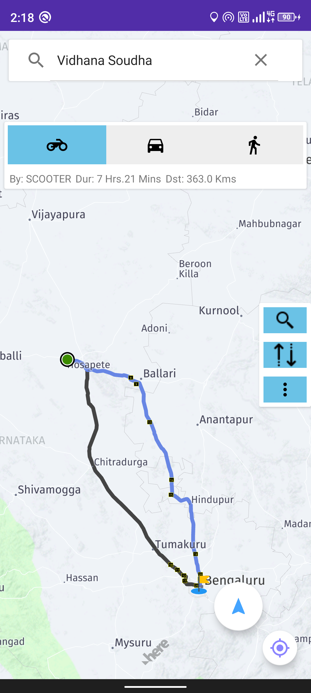

# LetsMeet 

 An Event managing,coordinating Android Application with **_Here Map_** Integrated on it using Kotlin.
 ## Here Map
 * Here map is used to share the location of the event with this particular App only.
 * And it is used to locate the Meeting Location and it is also used to navigate to the perticular location
 
 ## Retrofit API
 * Retrofit Api is used for the data serialization.
 * All Database Operations performed with the help of PHP scripts.
 * MySQL Database is used for Database operations.
 
<h2> Login and Registration Pages</h2>

<h2> Events, Calender and Editing Event Details Pages</h2>
 

<h2> Here map showing a Location and Routes to The Location</h2>
              
